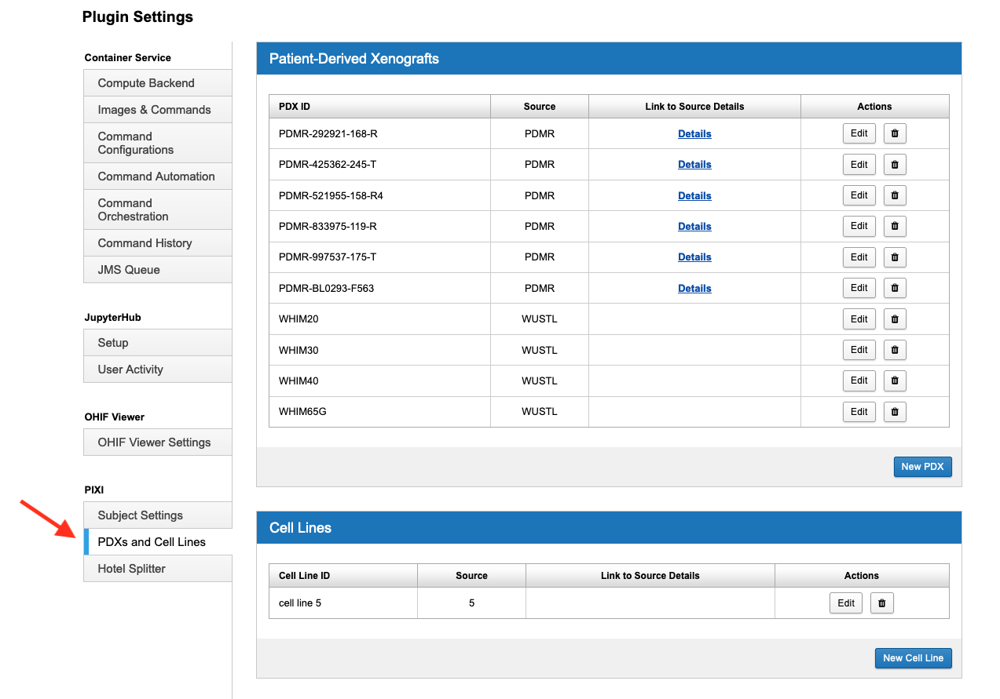

Administration
==============

Plugin Settings
---------------

--------------------------
Site Plugin Settings
--------------------------
*Subject Display*

*Species and Animal Vendor Preferences*

**PDX and Cell Line Preferences**
Patient-Derived Xenograft (PDX) information is maintained by PIXI as a site-wide resource.
That allows the PDX information to be entered once and reused/referenced in a single project and across multiple projects.
You can manage the set of PDXs as an administrator.
Cell lines are managed globally in the same way.

From any view, select Administer -> Plugin Settings in the menu bar.
Select *PDXs and Cell Lines* under Plugin Settings (PIXI) in the left flap.
You can create, update or delete a PDX enter or a Cell Line entry when the administration page is rendered.
You can provide a web link for both types of entities to refer to documentation provided by the PDX or Cell Line provider.

--------------------------
Hotel splitter configuration
--------------------------

------------------------------------
Experiments for Small Animal Imaging
------------------------------------

--------------
Project Settings
--------------

--------
Searches
--------

