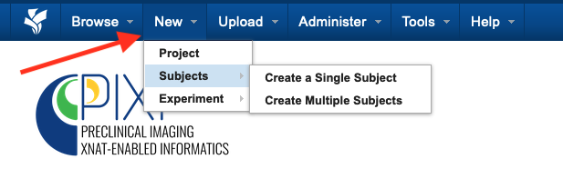
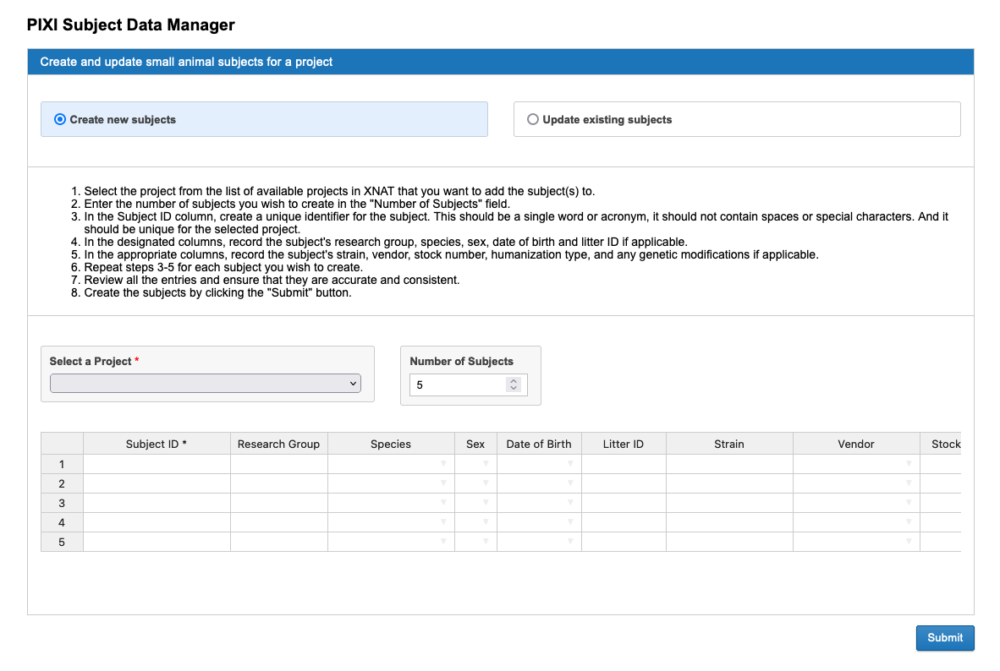
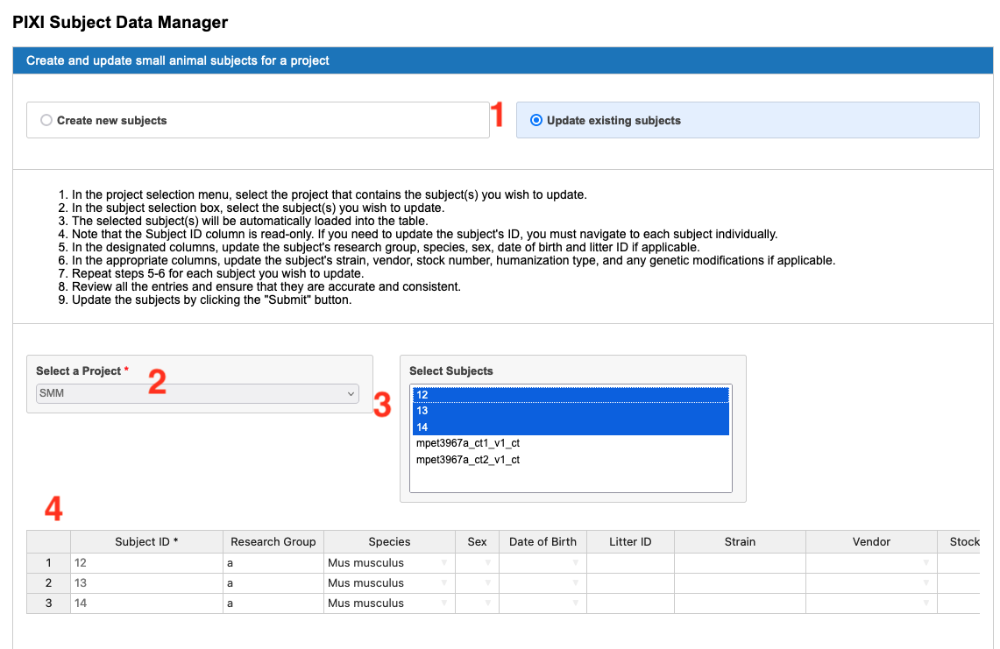

User Instructions
=====

Using XNAT
------------
The `XNAT platform`_ provides a rich environment for managing imaging data with reporting, container-based processing and modular extensibility.
The PIXI plugin is one example of extending XNAT for a new purpose.
PIXI users should read and understand `How To Use XNAT`_ for baseline information.
The information provided below will describe functions that are specific to PIXI.

Batch Data Entry
----------------

Core XNAT provides forms that allow the user to enter data for various items managed by XNAT and the PIXI plugin.
PIXI adds a new capability where many of the data types managed by PIXI can be created or modified using a spreadsheet model and web user interface.
Core XNAT normally provides a form that operates on one item (e.g., subject) at a time.
Because many experiments in small animal imaging involve multiple subjects imaged or otherwise processed at the same time,
the PIXI plugin will allow the user to enter data in batch mode in a spreadsheet.

As with core XNAT, the PIXI system will extract metadata from DICOM files and store those directly in the XNAT database.
Mentioning data entry does not imply that users will re-enter acquisition and other metadata found in a DICOM image.
PIXI maintains the automated data extract from DICOM images into the XNAT database.

Small Animal Subject Model
--------------------------

PIXI includes a new data type to support attributes for small animal imaging that are not present in the human model in core XNAT.
Details of this and other data types are found in `PIXI Data Model <pixi_data_model.html>`_

PIXI and core XNAT support three mechanisms for creating research subjects in the database:

- User creates subjects in the web UI
- XNAT accepts DICOM files and creates subjects per data in the DICOM files (assuming subjects do not already exist)
- External software can invoke the XNAT REST API to create a subject.

We will discuss the first method on this page.
Select New -> Subjects from the main menu.

You can then select "Create a Single Subject" for the traditional web form or "Create Multiple Subjects" for batch entry.
Select "Create Multiple Subjects" to direct PIXI to the Subject Data Manager page.

In this context, you can batch enter multiple research subjects using a spreadsheet model.

- Select the project where the subject information will be stored.
- The software defaults to a spreadsheet with 5 rows, but you can increase the number of rows.

You will likely find it convenient to fill in one row and then copy/paste common data into the following rows.

*Note: You cannot copy/paste into the Subject ID row as that column requires unique values.
Copy and paste into the other cells, but enter the Subject ID information separately.*

This same page will allow you to update multiple subjects in batch mode. See the screen capture below.

1. Select "Update existing subjects"
2. Select the project of interest
3. Shift-click multiple subjects
4. PIXI fills in the rows with existing values. Edit as necessary and then Submit to commit the changes.

Experiments for Small Animal Imaging
------------------------------------

XNAT and PIXI support a wide range of *experiments* that are in the data model just below subject.
`The XNAT wiki describes an experiment as follows`_:

   An experiment is an event by which data is acquired.
   This data can be imaging data, or non-imaging data.
   Similar to subject, an experiment cannot exist outside the context of a project.
   It is owned by the project which first added it.
   It can additionally be shared into other projects.
::

Imaging sessions like CT, MR and PET are XNAT *experiments* and are strongly typed items that are managed in the XNAT database.
PIXI adds *experiment* types to XNAT and manages those as first class items in the XNAT database.
The table belows lists the experiment types that are added by the PIXI plugin.
The models for these data types are found in `PIXI Data Model <pixi_data_model.html>`_

+---------------------------+----------------------------------------+
|  Type                     | Comments                               |
+===========================+========================================+
| Caliper Measurements      | For measuring lesions                  |
+---------------------------+----------------------------------------+
| Drug Therapy              | Drug interventions and not PET tracers |
+---------------------------+----------------------------------------+
| Weight                    | A point in time measurement            |
+---------------------------+----------------------------------------+
| Cell Line                 |                                        |
+---------------------------+----------------------------------------+
| Patient Derived Xenograft | PDX                                    |
+---------------------------+----------------------------------------+
| Animal Husbandry          | Feeding, Fluids and Housing            |
+---------------------------+----------------------------------------+

Hotel Splitter
--------------

Searches
--------

.. _XNAT platform: https://www.xnat.org
.. _How To Use XNAT: https://wiki.xnat.org/documentation/how-to-use-xnat
.. _pixi_data_model:
.. _The XNAT wiki defines an experiment as follows: https://wiki.xnat.org/documentation/how-to-use-xnat/understanding-the-xnat-data-model